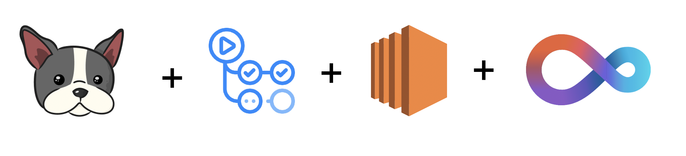
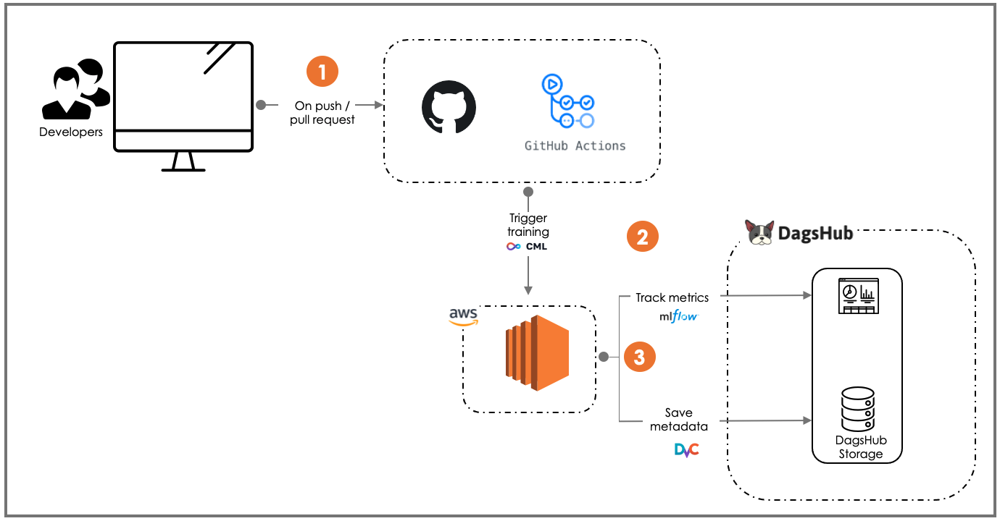
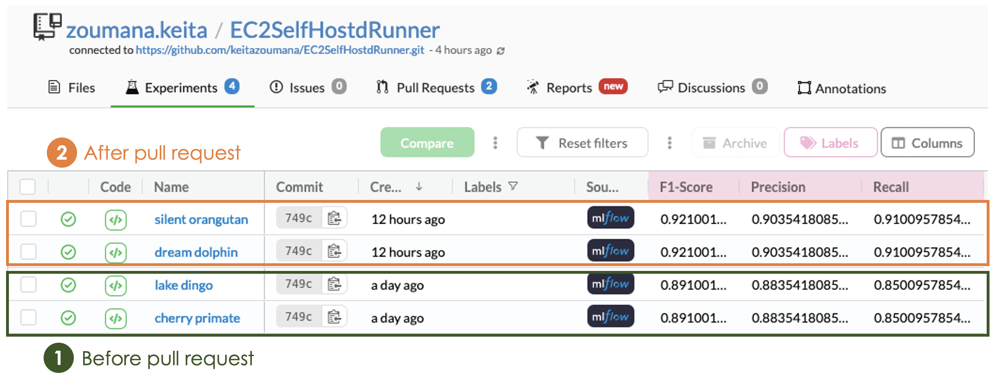

# How to Use an AWS EC2 instance as Self-hosted Runner for Continuous Machine Learning.   

  

## Main Concepts Covered 
After completing this repository, you will be able to understand the following concepts: 
- Provision an [AWS EC2](https://aws.amazon.com/fr/ec2/) and running the training of a [BERT](https://huggingface.co/docs/transformers/model_doc/bert) model  with [CML](https://cml.dev/)
- Implement a Github actions pipeline using the previous instance. 
- Automatically log your models metrics with [MLFlow](https://mlflow.org/). 
- Automatically save your training metadata on [DVC](https://dvc.org/) for easy tracking. 

  

# Getting started  
### 1. Prerequisites
#### Platforms 
##### AWS EC2 instance properties   
A free tier is enough for this use case. Below are the properties of the EC2 instance used for the use case. 
- cloud type: t2.micro. 
- cloud-region: us-east-1a

##### Other platforms
- Access to [DagsHub](https://dagshub.com/)
- Access to [GitHub Actions](https://github.com/features/actions)

#### Other ressources
- Python 3.9.1 
- DVC 2.11  
- CML 
- You can find all the additional information in the `requirements.txt` file

## Results On DagsHub
DagsHub provides the capabilities to use MLFlow and DVC while giving the choice of working on Github. The following results are the experiments from DagsHub, using MLFlow to track the model `F1-Score`, `Precision` and `Recall`.

### MLFlow metrics before and after pull request. 
The following graphics shows the performances of the models for different epochs. 
#### Before the pull request:
- Epoch = 1  
- F1 score = 0.89  
- Precision = 0.88 
- Recall = 0.85  

#### After the pull request:
- Epoch = 2  
- F1 score = 0.92  
- Precision = 0.90 
- Recall = 0.91  

  

